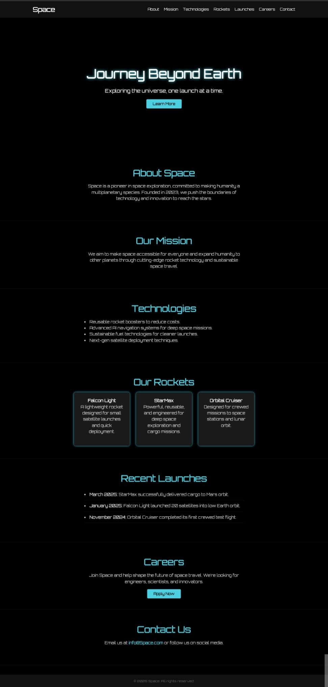

# 🚀 Space – Simple Space Exploration Landing Page

Space is a simple, modern, and responsive **Landing Page** inspired by SpaceX. This project was built to practice front-end web development skills, learn GitHub deployment, and simulate a futuristic space technology company site.

---

## 📸 Preview

## 🎯 The objective of this project 

- Is to design and develop a simple, modern, and responsive landing page for a fictional space exploration company called Galaxy

---

### Link

- Live Site URL: [Space website](https://minalfatih.github.io/Explore-webstie/)

---

## 🧩 Features

- ✨ Modern, clean UI with space-themed visuals.
- 📱 **Fully responsive** for mobile, tablet, and desktop screens.
- 📷 Uses free space-related images to enhance interaction.
- ⚙️ Organized sections: About, Mission, Technologies, Rockets, Launches, Careers, Contact.
- 🌐 Smooth navigation with anchor links.
- 🧑‍🚀 Ready to be extended into a real startup presentation.

---

## 🛠️ Technologies Used

- **HTML5**
- **CSS3**
- Google Fonts (`Orbitron`)
- Responsive layout (Flexbox & Media Queries)

---

## Contributors
- Amina Elfatih Osman Abd Elwahab
- Mohammed
